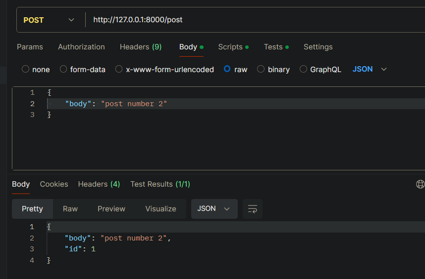
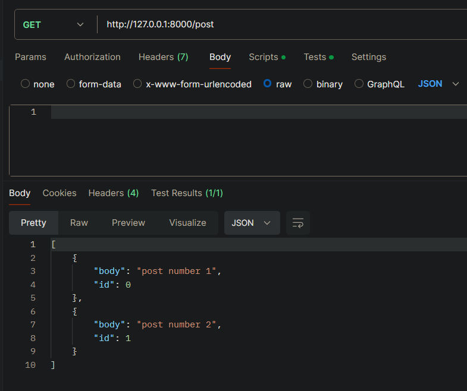

# Social Media API with FastAPI

This repository contains a simple social media backend API built using FastAPI. It allows users to create posts and
comments, and retrieve them along with their associated data. The API leverages `pydantic` for data validation
and `APIRouter` for organizing the endpoints.

## Features

- Create a new post
- Retrieve all posts
- Create a new comment on a post
- Retrieve comments for a specific post
- Retrieve a post along with its comments



----



## Endpoints

### Create a Post

- **URL:** `/post`
- **Method:** `POST`
- **Request Body:**
  ```json
  {
    "body": "This is a new post."
  }
  ```
- **Response:**
  ```json
  {
    "body": "This is a new post.",
    "id": 0
  }
  ```

### Get All Posts

- **URL:** `/post`
- **Method:** `GET`
- **Response:**
  ```json
  [
    {
      "body": "This is a new post.",
      "id": 0
    }
  ]
  ```

### Create a Comment

- **URL:** `/comment`
- **Method:** `POST`
- **Request Body:**
  ```json
  {
    "body": "This is a comment.",
    "post_id": 0
  }
  ```
- **Response:**
  ```json
  {
    "body": "This is a comment.",
    "post_id": 0,
    "id": 0
  }
  ```

### Get Comments for a Post

- **URL:** `/post/{post_id}/comment`
- **Method:** `GET`
- **Response:**
  ```json
  [
    {
      "body": "This is a comment.",
      "post_id": 0,
      "id": 0
    }
  ]
  ```

### Get a Post with Comments

- **URL:** `/post/{post_id}`
- **Method:** `GET`
- **Response:**
  ```json
  {
    "post": {
      "body": "This is a new post.",
      "id": 0
    },
    "comments": [
      {
        "body": "This is a comment.",
        "post_id": 0,
        "id": 0
      }
    ]
  }
  ```

## Usage

To use the API, follow the installation steps and run the application. You can interact with the API using tools
like `curl`, `Postman`, or directly from your code.

## Project Structure

- `main.py`: The main entry point of the application.
- `routers/posts.py`: Contains the routes for managing posts and comments.

## Dependencies

- **FastAPI:** A modern, fast web framework for building APIs with Python 3.7+.
- **pydantic:** Data validation and settings management using Python type annotations.
- **uvicorn:** A lightning-fast ASGI server for serving FastAPI applications.

